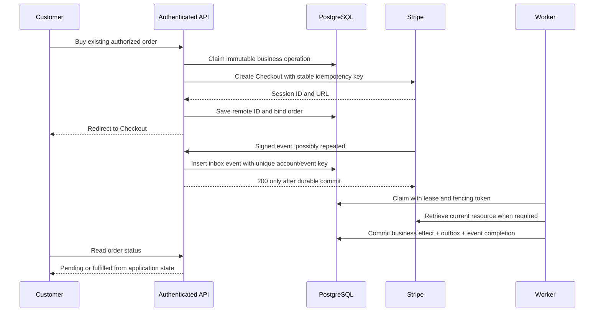

# Distributed architecture and invariants

## The two independent systems

Stripe and your database do not participate in one atomic transaction. An API call can succeed at Stripe and time out before your service sees a response. Your database can commit and your HTTP response can disappear. A worker can stop after delivering an email but before recording delivery.

Build from invariants:

1. One immutable business operation binds to one request payload.
2. Remote retries use that operation's stable Stripe idempotency key.
3. A verified event is durably stored before it is acknowledged.
4. Local fulfillment and its deduplication guard commit together.
5. External side effects have their own durable delivery intent and deduplication contract.
6. Every object and effect belongs to an explicit account, mode, tenant, and business identity.
7. Uncertainty is visible and recoverable; it is never silently converted to success.

These are design requirements you can test. “Exactly once” without a boundary is not a useful requirement.

## End-to-end flow

The redirect page is read-only. A reconciliation job can repair missing fulfillment through the same transactional business function used by a webhook worker. This preserves a single mutation rule without requiring a globally single worker.

## Three different identities

**Request identity** identifies a business command: `tenant-17:order-742:checkout-attempt-1`. It is allocated when the order attempt is created, not randomly on every browser request. A deliberate second purchase gets another identity.

**Transport identity** identifies an event delivered by Stripe, such as `evt_...`. It removes repeated delivery of that event.

**Business-effect identity** identifies the local action, such as `tenant-17:order-742:fulfill`. It removes the same action requested by different event types or a recovery job.

Conflating them causes bugs. Both a Checkout completion and a later asynchronous success may concern the same order. Conversely, identical carts can represent two valid purchases. SafeStripe therefore hashes operation identity for the remote key and hashes canonical parameters separately to detect conflicts.

Stripe's idempotency layer retains results for eligible requests, compares reused parameters, and may prune keys after they are at least 24 hours old. Some pre-execution failures are not retained. Review [Stripe idempotent requests](https://docs.stripe.com/api/idempotent_requests) before designing automatic replay.

## Durable command protocol

SafeStripe first records `(scope, tenant, operation ID, kind, fingerprint, key)` in PostgreSQL. A short transaction obtains or locks that row. Competing live requests receive `BUSY`; a changed fingerprint receives `PAYLOAD_CONFLICT`.

The Stripe call happens outside the database transaction. On success, the object ID is recorded. On an ambiguous failure, the operation becomes retryable. A retry uses the original key. Completed calls retrieve the current object by saved ID instead of reissuing the mutation. This means the response is current state, not a historical HTTP-body replay.

If the operation is still unresolved 23 hours after initial creation, automatic mutation stops with `REVIEW_REQUIRED`. The earlier deadline creates margin before possible key pruning. It can stop an operation that never actually reached Stripe; that is the intentional cost of failing closed under uncertainty.

Do not delete old successful operations while their business IDs remain reusable. A missing record removes the conflict guard. Archive to a durable tombstone or retain it for the domain's replay horizon. Restoring a database backup also changes what you know: reconcile lost writes before reopening payment commands.

### Failure timeline

| Failure point | Known facts | Safe recovery |
| --- | --- | --- |
| Before operation claim | No command admitted | Retry request after authentication |
| After claim, before Stripe | Request may not have been sent | Wait for lease, retry same key within window |
| Stripe succeeded; reply lost | Local outcome uncertain | Retry unchanged key; inspect request history if unresolved |
| Stripe succeeded; DB update failed | Remote object may exist | Same key recovers response; no new business ID |
| Lease expired while old worker runs | Two processes may overlap remotely | Stripe key deduplication plus local fencing |
| More than retry window elapsed | Stripe may no longer deduplicate | Operator reconciliation, then bind proven remote ID |

Stripe may cache server errors as part of an idempotent result. Do not generate a new key simply because the cached result is inconvenient. Its [low-level error guidance](https://docs.stripe.com/error-low-level) explains indeterminate outcomes; use business evidence and request history to resolve them.

## Durable event protocol

Verify the original bytes with Stripe's SDK and the endpoint secret. Check account, mode, payload family, API version, and event shape. Save accepted events using a unique `(queue, scope, event ID)` key, then return success. Storage failure returns a retryable HTTP error. Invalid signatures never enter the inbox.

Events can be duplicated and reordered, and delivery retries are finite. Therefore combine event ingestion with periodic reconciliation. The queue's presence does not prove the handler succeeded. Watch oldest pending age, dead letters, and business-effect completion. Stripe documents the delivery and verification rules in [webhooks](https://docs.stripe.com/webhooks).

## Worker leases and fencing

`FOR UPDATE SKIP LOCKED` lets multiple workers claim independent jobs without selecting the same live row. Each claim gets a random token and a lease. Completion locks the job and verifies its current token and unexpired lease before any local handler writes. A stale process cannot commit another worker's job.

The handler and done marker use the same database connection and transaction. If a handler writes through a global pool instead of the supplied `tx`, it has escaped the atomic boundary. If it emails a customer inside that transaction, rolling back cannot unsend the email. Those are integration errors the library cannot automatically undo.

`effectOnce` inserts a business guard and performs local work inside the caller's transaction. A crash rolls both back; a subsequent attempt can retry. The guard must be kept as long as old events or recovery commands can reappear. Per-event deduplication is insufficient for one business action triggered by several events.

## Outbox and external systems

Within the local transaction, insert an outbox intent. A separate dispatcher claims it, sends to a recipient with a stable delivery key, and records completion. A response lost after external delivery means another attempt may send the same message. Only a recipient that honors that key: or another domain-specific deduplication scheme: can prevent the duplicate external effect.

The default example leaves outbox intents visible for inspection. It does not pretend that an email was sent. Production must configure a delivery consumer, retry budget, dead-letter procedure, and data-retention policy. Refunds, inventory release, shipments, and emails need separate business semantics; a generic “undo” callback is not adequate.

## Out-of-order events and current state

An old event should usually act as an invalidation signal for a mutable subscription projection. `refreshProjection` locks a resource row, retrieves the current Stripe resource, and writes a minimal projection under that lock. This avoids a slower stale fetch overwriting a newer fetch from another worker.

The example deliberately holds a database lock across a bounded read to Stripe. This is easy to reason about but consumes a connection during network latency. Keep read timeouts short and disable nested read retries. At higher volume, replace it with per-resource partitioning or a versioned refresh-command protocol; retain the same state invariant. Do not remove the lock and assume `event.created` gives a total order: it does not.

Financial history needs a different strategy. Import immutable financial movements by balance-transaction identity. A mutable “current total paid” snapshot cannot replace a journal of payments, refunds, fees, disputes, and reversals.

## Architectural decision record

PostgreSQL is the initial durable queue because command records, effects, and application writes can share a transaction. Redis is useful for rate limits or caches, but adding it as another authoritative ledger increases failure modes. A dedicated broker becomes justified when measured backlog, fan-out, or throughput requires it. Publish from a transactional outbox; do not dual-write a database and broker and hope both succeed.

Start with one write region per account/domain. Cross-region failover must preserve the authoritative operation and effect records. Active-active payment writers with asynchronously replicated deduplication tables can double-admit a purchase. Choose consistency and recovery objectives before selecting deployment topology.
