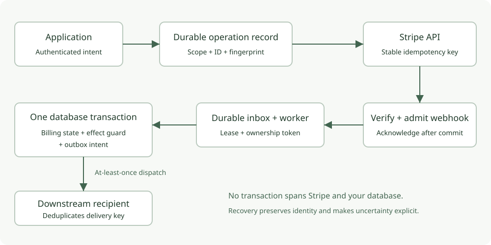
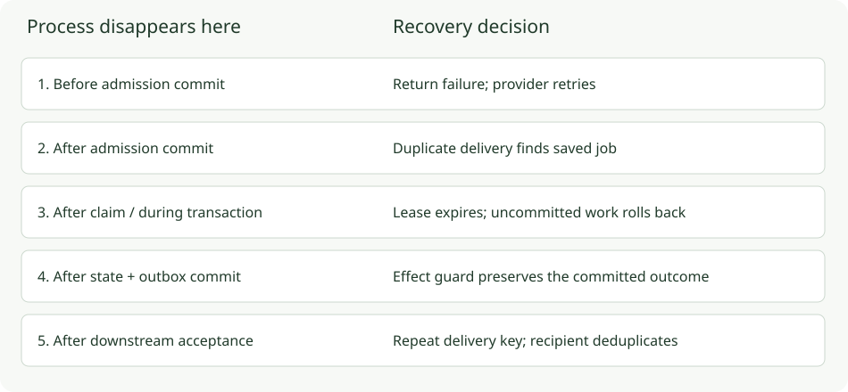

# Reliability contracts and evidence

SafeStripe coordinates Stripe with your database. Neither system can commit a transaction on behalf of the other. The library stores enough identity and progress to make retries deliberate, preserve work after process failure and surface outcomes that need review.

These contracts apply to supported SafeStripe methods and transactions. Calls made directly through the Stripe SDK, external work inside a retried transaction callback, lost database history and incorrect application authorization are outside them.

## 1. One operation keeps its identity

**Problem:** a server times out after Stripe accepts a request. A new request identity could create a second charge or refund.

**Mechanism:** the caller supplies a stable business operation ID. SafeStripe binds its scope, kind and parameter fingerprint in durable storage, derives a stable Stripe key, and retrieves the recorded resource on completed retries. Changed terms conflict. Unresolved older operations enter review instead of being retried indefinitely.

**Evidence:** `tests/operations.test.ts`, `tests/storage.test.ts` and `tests/scenarios.test.ts` exercise competing claims, parameter conflicts, successful replay and the recovery cutoff. The mocked SDK fixture does not establish real remote outcomes. The [protected service report](evidence/stripe-protected-secret-2026-10-06.json) separately verifies one remote customer after response loss and replay. The [public lifecycle suite](30-payment-lifecycle.md) checks refund replay through the deployed npm consumer. Dedicated sandbox work is tracked in [issue 3](https://github.com/Israel-oduguwa/SafeStripe/issues/3).

**Boundary:** Stripe's key retention is finite. Retain local operation history, keep the same ID on retries, and review ambiguous outcomes before the configured cutoff. A restored database can be missing writes Stripe already accepted. Reconcile before reopening payment writes.

## 2. Admission precedes acknowledgment

**Problem:** acknowledging a webhook before storing it lets a process crash erase the work.

**Mechanism:** the receiver verifies the original bytes, signature, mode, account scope and API version, then awaits durable admission. Storage failure propagates to the HTTP adapter. Authentic unsupported event types may be explicitly ignored; they are not admitted work.

**Evidence:** receiver and adapter tests reject invalid events and persistence failures. Storage conformance exercises atomic admission. Process recovery tests start with a committed inbox job.

**Boundary:** process durability relies on the database's durability configuration. This does not promise survival of database loss, destructive retention, or restoring an old backup.

## 3. Work ownership is recoverable

**Problem:** a worker claims a job and disappears. Another worker must recover it, while the original owner must not overwrite the new result.

**Mechanism:** claims have expirations and ownership tokens. Completion checks state, lease and token in the same transaction as handler writes. Reclaiming changes ownership. Exhausted work moves to a dead state for reviewed replay.

**Evidence:** `tests/chaos/recovery.test.ts` kills real child processes after claim and during the effect transaction, then recovers with a second process. It also checks stale completion and graceful SIGTERM. PostgreSQL runs require a real disposable database; local SQLite runs use one active worker at a time.

**Boundary:** eventual progress requires available storage, a running worker and an unexhausted retry policy. Lease expiry does not stop code already executing or fence arbitrary external services.

## 4. One committed effect per business key

**Problem:** different events can describe the same business outcome. Deduplicating only event IDs cannot prevent duplicate fulfillment.

**Mechanism:** `effectOnce` stores the business effect guard and the associated billing-record writes inside a serializable transaction. Every event for the same outcome must use the same scoped business key.

**Evidence:** the chaos suite admits repeated deliveries and distinct event IDs for one order, then asserts one fulfillment and one guard. PostgreSQL CI adds twenty competing worker processes.

**Boundary:** handler execution can repeat. Only the guarded transaction's committed effects are deduplicated. Do not send email, make Stripe mutations or call external services inside the transaction callback. The portable context writes SafeStripe records; unrelated application tables/documents do not automatically join its transaction.

## 5. State and downstream intent commit together

**Problem:** state commits but the process crashes before sending an email or downstream request.

**Mechanism:** an outbox intent shares the state/effect transaction. A separate dispatcher sends it using a stable delivery key. Delivery is at least once.

**Evidence:** the process suite kills a sender after a simulated receiver durably accepts delivery but before sender completion. Recovery delivers again; the receiver's own guard prevents a second effect. Both the repeated delivery and the single recipient effect are asserted.

**Boundary:** the receiver must honor the delivery key or provide an equivalent business constraint. SafeStripe cannot make an arbitrary third-party endpoint exactly once.

## What a crash changes

| Failure point | Required response |
| --- | --- |
| Before inbox commit | Return failure; Stripe can retry |
| After inbox commit, before acknowledgment | A repeat finds the admitted job |
| After claim, before effect commit | Recover after lease expiry; uncommitted work rolls back |
| After effect/outbox commit | Preserve the result; reprocessing uses the effect guard |
| After recipient acceptance, before delivery acknowledgment | Retry the same delivery key; recipient deduplicates |
| After database restore | Suspend mutations and reconcile gaps against Stripe |

Read [the ADRs](adr/README.md), [security boundaries](07-security-and-scale.md) and [verification record](../VERIFICATION.md). Tests demonstrate the stated scenarios; they are not an independent security audit or a throughput guarantee.
