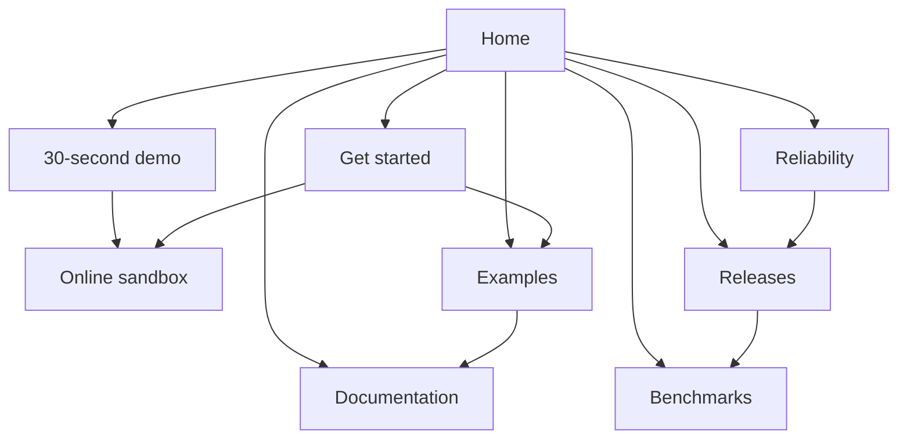

# Website

Public preview: https://israel-oduguwa.github.io/SafeStripe/

The public site has seven static pages and the generated SafeStripe handbook. It has no API server, analytics script or third-party font request. Visitors can understand the reliability problem, inspect retained evidence and reach the sandbox without reading the whole handbook.

## Page structure

```text
Home
├── Demo — 30-second sandbox motion replay and source evidence
├── Reliability — contracts, transaction boundaries and failure recovery
├── Benchmarks — retained measurements, machine details and failed attempts
├── Examples — Express, Next.js and supported storage requirements
├── Get started — first browser payment and consumer installation
├── Releases — current version, verification and adoption requirements
└── Documentation — searchable technical handbook
```



| Page          | URL                   | Visitor's next step                                             |
| ------------- | --------------------- | --------------------------------------------------------------- |
| Home          | `/`                   | Understand the problem and make a first payment                 |
| Demo          | `/demo/`              | Watch the sandbox replay, inspect evidence or download the film |
| Reliability   | `/reliability/`       | Review contracts, tests and architecture decisions              |
| Benchmarks    | `/benchmarks/`        | Inspect a configuration and download its original JSON          |
| Examples      | `/examples/`          | Select a framework and follow the complete integration guide    |
| Get started   | `/get-started/`       | Try the sandbox or install in an application                    |
| Releases      | `/releases/`          | Review payment evidence and remaining adoption requirements     |
| Documentation | `/docs/handbook.html` | Search a guide or use its permanent section anchor              |

URLs are relative to the deployment root, including the `/SafeStripe/` GitHub Pages project path. Existing handbook anchors and raw benchmark report URLs remain available. The build emits `sitemap.xml` with the seven pages and handbook.

## Navigation and interactions

The shared header links to Demo, Reliability, Benchmarks, Examples, Releases and Docs, with a separate sandbox action. The home page and footer link to Get started. Active header links use `aria-current="page"`. The footer groups Build, Inspect and Project links.

At widths of 820 pixels or less, the menu button expands the navigation in place. Escape closes it and returns focus to the button. Navigation remains visible when JavaScript is unavailable. Framework and benchmark tabs support Left, Right, Home and End keys. Tables have captions, headers and focusable scroll regions rather than forcing the entire page to overflow on a phone.

Home links directly to every main page. Reliability links to architecture, runbooks and verification. Benchmarks links to its protocol, original reports and CI runs. Examples and Get started link to configuration, routes, workers and readiness. No important page is orphaned.

The demo uses a native video player with an optional caption track, a poster, download links and four chapter shortcuts. It never autoplays. A pending play or buffering event shows a spinner over the poster or retained video frame; errors, pause and a 15-second interface deadline restore the controls. The transcript and original evidence remain accessible without playback.

## Content and evidence sources

`layout.html` supplies the shared document, header and footer. `index.html` and `pages/*.html` are content fragments. `scripts/site-pages.mjs` defines routes and renders benchmark tables from `benchmarks/results/*.json`; values are not copied into marketing HTML. The SQLite report remains a legacy baseline, with missing measurements labelled **Not recorded**. Original failed PostgreSQL attempts and corrected warm-ups stay visible.

The build highlights the existing TypeScript example fragments with Shiki. These fragments assume configured application authorization and storage; the linked handbook contains the full setup. The website does not claim a completed NestJS example, external users, production capacity or independent security certification.

`npm run site:check` validates every page and the handbook's local links, headings, metadata, template completion, benchmark data boundaries, tab keyboard behavior, mobile-menu state and clipboard fallback. It also verifies video manifest hashes, source-evidence identity, playback waiting/recovery and chapter selection. Recheck desktop and phone layouts after changing styles. The build publishes tracked public guides and examples plus an explicit allowlist of demo media. It does not publish tester contact lists or local review frames.

## Preview locally

```bash
npm ci
npm run site:build
npm run site:check
npm run site:preview
```

Open http://127.0.0.1:4243. Build output lives in site-dist and is excluded from Git and the npm package. Build again after changing a page, stylesheet or documentation source.

## Publish

Use these settings on a static host:

| Setting          | Value                                    |
| ---------------- | ---------------------------------------- |
| Node             | 22.19 or newer                           |
| Install          | npm ci                                   |
| Build            | npm run site:build && npm run site:check |
| Output           | site-dist                                |
| Framework preset | Other / static site                      |

On Vercel, import the SafeStripe repository and use the supplied vercel.json. The preview server is for local review only; Vercel serves the generated files directly.

On GitHub Pages, enable Pages with GitHub Actions as its source and run the **Publish website** workflow manually. The workflow builds and checks the site before deploying. It is manual so a documentation change does not publish an unfinished release.

The site uses relative links and works from a project subpath. Do not upload the whole repository, .env files, service-account keys or the local demo app.

## Package name transition

The unscoped `safestripe@0.3.0` package is published. A [clean registry installation](../docs/evidence/npm-registry-2026-10-06.json) verified the archive, exports and types before `npmPublished` was set to `true` in `site/release.json`. The copy button now supplies the public install command. The release remains an evaluation preview; publication alone does not change the [readiness requirements](../docs/28-release-readiness.md). Keep the previous npm package available for existing consumers.

The demo is a separate application with a Vercel frontend and a Render Express backend. Its Firestore worker runs on the backend; a static documentation host cannot run it.

## Support link

Set `url` in `support.json` to the maintainer's verified public Buy Me a Coffee creator URL. A null value hides the support button. Both the landing page and offline handbook use this configuration. The build rejects unrelated domains, credentials, query strings and non-HTTPS URLs rather than publishing an incorrect payment destination.

The modal opens only when someone chooses it. It uses a native dialog with Escape dismissal and focus restoration, and links to Buy Me a Coffee in a separate tab. No payment fields, embedded widget or third-party tracking load on SafeStripe's pages.
